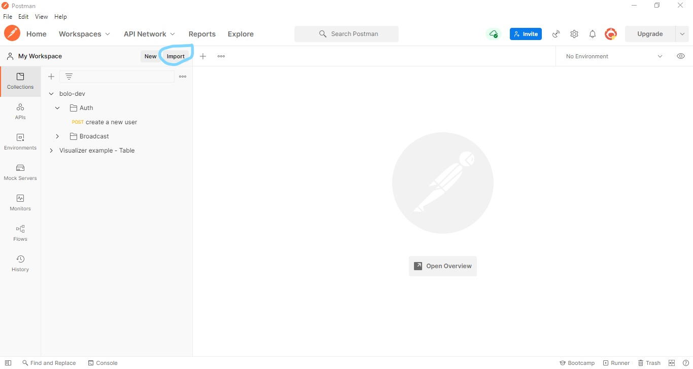
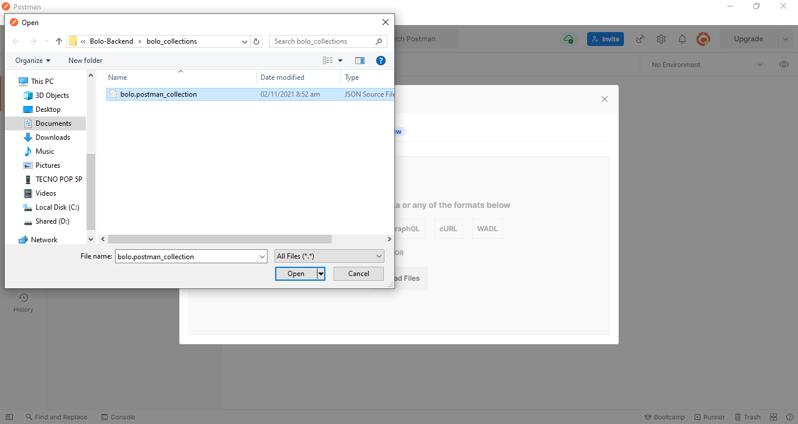
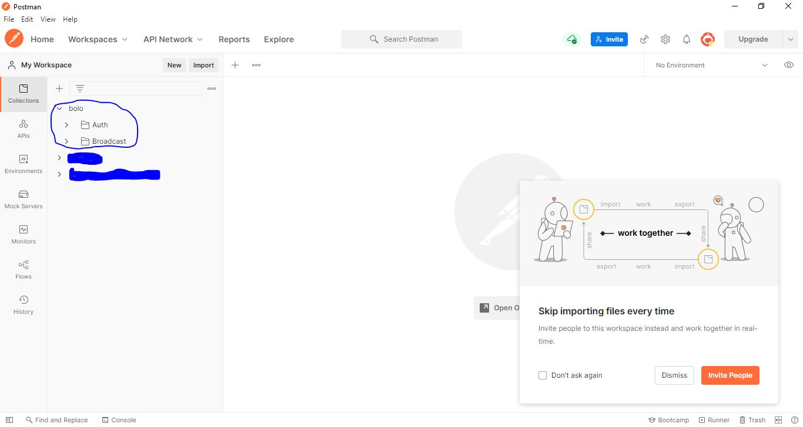
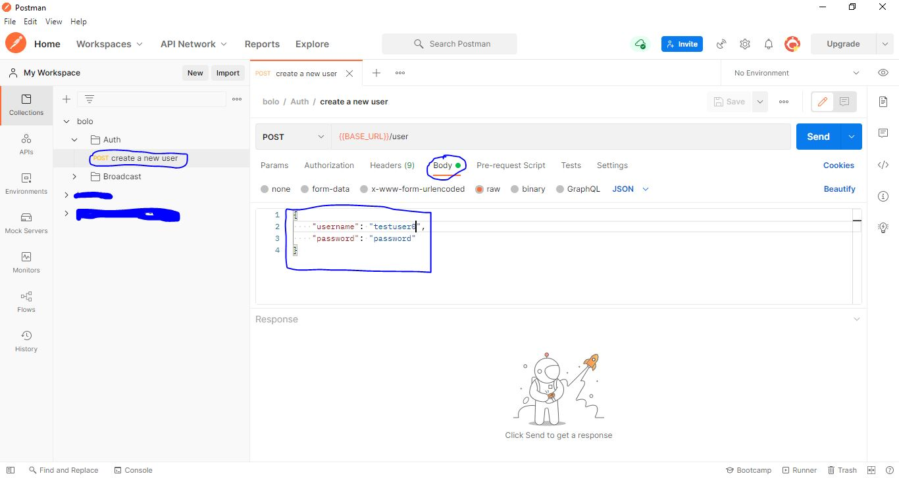
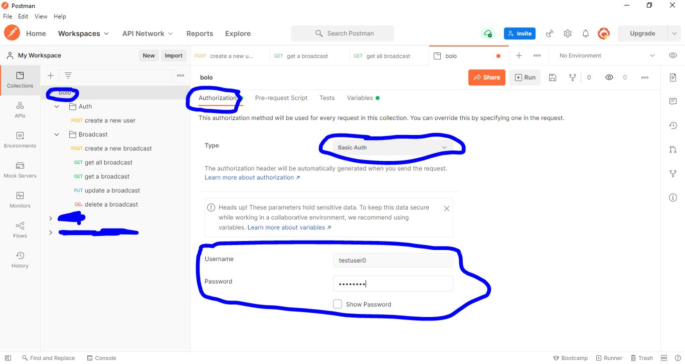

# Bolo-Backend

A simple API utilizing HTTPBasicAuth for authentication.


## Built with

- [Python](https://www.python.org/downloads/release/python-3100/)
- [Flask](https://flask.palletsprojects.com/en/2.0.x/)
- [Flask-SQLAlchemy](https://flask-sqlalchemy.palletsprojects.com/)
- [Flask-HTTPAuth](https://flask-httpauth.readthedocs.io/)
- [Flask-Cors](https://flask-cors.readthedocs.io/)
- [Flask-Migrate](https://flask-migrate.readthedocs.io/)
- [Python-Dotenv](https://pypi.org/project/python-dotenv/)


## Running the project.

This project was developed using the python version 3.10, but anything greater than python version 3.6 should work fine. You can test the endpoints using an API testing tool. For this project I will be using postman. I have included a postman collection in the project. If you do not already have postman installed you can download the desktop app using this [link](https://dl.pstmn.io/download/latest/win64).

1. Using console, navigate into the bolo directory. You can use either poetry or virtualenv to create a virtual environment for the project.

> - **Using poetry**
> In the bolo directory if you have poetry installed, you can use the poetry install command in console to create a new virtual environment and install the dependencies as specified in the "toml" file.
>> ```console
>> poetry install
>> poetry shell
>> ```
> - **Using virtualenv**
> In the bolo directory you create a new virtual environment using virtualenv, activate the virtual environment, then run "<code>pip install -r requirements.txt</code>" in console.
>> ```console
>> pip install -r requirements.txt
>> ```

2. Using console navigate into the src\bolo directory make a new file named .env, copy the contents defined in **ENVIRONMENT VARIABLES** and set the <secret_key>, <database_name> as desired.
> ```console
> cd src/bolo
> type nul > .env
> ```
> **ENVIRONMENT VARIABLES.**
> ```text
> FLASK_APP=:app
> FLASK_DEBUG=True
> SECRET_KEY=<secret_key>
> DATABASE_URL=sqlite:///<database_name>.db
> SQLALCHEMY_TRACK_MODIFICATIONS=True
> JSON_SORT_KEYS=False
> BASE_URL=127.0.0.1:5000
> ```

3. Using console, run the following commands:
> ```console
> flask db init
> ```
> This command initializes migration support for the database using Flask-Migrate.
> ```console
> flask db migrate
> ```
> This command autogenerates a new revision file.
> ```console
> flask db upgrade
> ``` 
> This command upgrades the database to a later version.

4. Using console, run the command "<code>flask run</code>".
> ```console
> flask run
> ```

5. I recommend that you familiarize your self with postman if you do not already know how to use it. We are going to be doing very basic stuff so it important that you atleast read this [article](https://learning.postman.com/docs/getting-started/introduction) first.
> **IMPORTING A POSTMAN COLLECTION.**
 - Navigate to the root directory of the project to find the > bolo_collections folder which contains an exported postman collection. First you have to have postman running on your desktop.
> 
 - Locate the import button, click on it and a screen pops up, make sure you are on the file tab. Then click on the upload files button, which brings up the file selector window. Then locate the bolo.postman_collection.json file.
> 
 - You should see a new bolo collection in the collections panel.
> 
6. **SETTING UP AUTHENTICATION.**
- First using the postman app navigate to the auth folder of the bolo collection. There is only a single request there. Select the request then navigate to the edit the json object to add a new user to the database.
> 

- Next we are going to set up the basic authorization, for the bolo collection, using the username and password for the user we just created.
> 

7. From here on out you can test the endpoints as you please.
> **NOTE** For endpoints containing an ```<broadcast_id>``` tag you are expected to fill them in with an appropriate value that is a broadcast id.